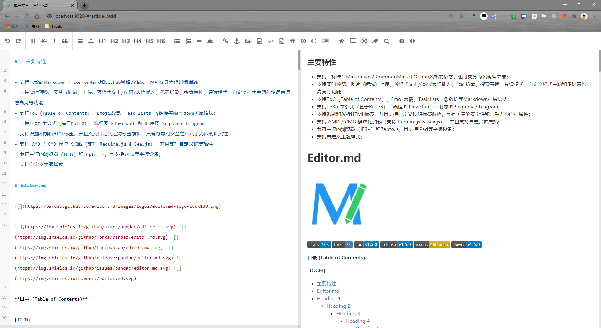
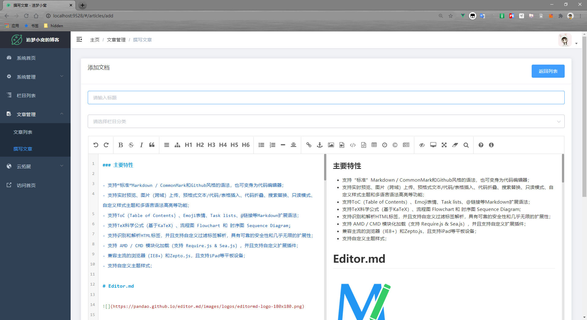

# editor-md 整合成Vue组件


前往  [演示地址](https://aszmxw.github.io/editor-md/)
## 效果图


- 下面是vue-element-template引用的



## 运行demo

### 第一步
```
git clone https://github.com/aszmxw/editor-md.git
```

### 第二步
```
npm install
```

### 第三步
```
npm run serve
```

## 参考了以下项目
- [x] showdoc
- [x] learnku


